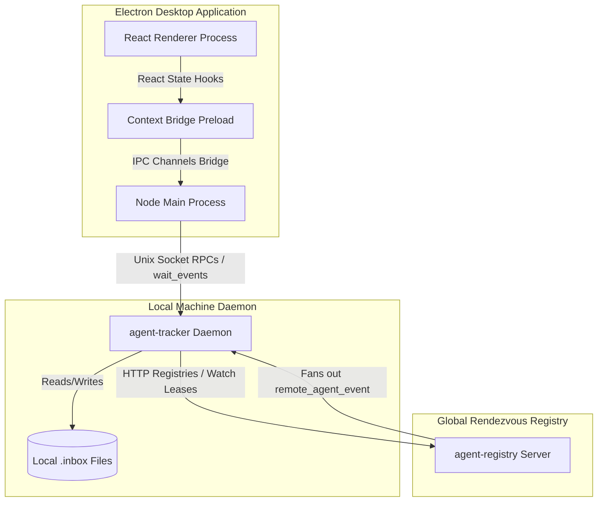

# Broccoli Comms Repository Architecture Summary

The `broccoli-comms` codebase is a modular, high-performance multi-agent monitoring and communication framework. It is divided into three distinct systems that coordinate seamlessly over local unix sockets, HTTP registry servers, and Node IPC bridges:

---

## 1. The Backend Daemon: `agent-tracker`
- **Language**: Python (zero external dependencies, standard libraries).
- **Role**: The central state keeper, tmux sessionizer, and event dispatcher running in the background on each local machine.
- **Key Components**:
  * **`state.py`**: Manages the active registered agents directory, in-memory active watchlist leases, and the global `event_sequence_id` cursored queue buffer (max 500 events).
  * **`rpc_handler.py`**: Exposes the net-socket JSON-RPC API. Key methods:
    * `spin_agent`: Spawns agent configurations in isolated tmux panes.
    * `capture_pane`: Triggers tmux pane captures and extracts terminal history buffers.
    * `send_input`: Injects direct text and symbolic keystrokes (Escape, Enter, Ctrl+C) into target panes.
    * `wait_events`: A blocking long-poll event receiver. Supports cursors (since sequence IDs), watchlists, and lease-expiry sweeps.
  * **`registry_client.py`**: Interfaces with the global HTTP registries, publishing agent heartbeats and delegating lease-bound remote watches.
  * **`test_state.py` / `test_rpc_handler.py` / `test_http_registry.py`**: Extensive unit and integration test suites (114 tests total).

---

## 2. The Rendezvous Service: `agent-registry`
- **Language**: Python (HTTP Server).
- **Role**: A stateless, lightweight directory lookup service deployed locally or on a public VPS to coordinate remote tracking nodes.
- **Key Components**:
  * **`server.py`**:
    * Tracks active node heartbeats transiently in RAM (zero database footprints).
    * Exposes `POST /trackers/<id>/watch-leases` to register lease-bound remote watch subscriptions.
    * Runs background sweep cycles to automatically purge expired watch leases.
    * Fans out remote events (`remote_agent_event`) over network routes when messages are delivered to watched targets.

---

## 3. The Desktop Interface: `agent-communicator-electron`
- **Tech Stack**: TypeScript + Vite + React + Tailwind/CSS + Electron.
- **Role**: The visual, interactive timeline and monitoring dashboard.
- **Architecture Layers**:

### A. Node Main Process (`src/main/`)
* **`main.ts`**: Manages window creation lifecycles, registers IPC handlers, and triggers event loop startup on window ready.
* **`ipc.ts`**: Handles Electron Main IPC invocations. Runs the background event loop: issues cursored `waitEvents` queries against the local socket daemon and pushes new events to the sandboxed React layer reactively via `webContents.send`.
* **`trackerClient.ts`**: The main RPC client bridging JavaScript calls to the daemon's UNIX socket.

### B. Context Bridge Preload (`src/preload/`)
* **`preload.ts`**: Exposes safe, sandboxed context bridges (`window.broccoliCommsMock`) to expose IPC channel listeners (`onTrackerEvents`) and select directory dialogue invocations to the Renderer process without compromising OS security.

### C. React Renderer Process (`src/renderer/`)
* **`App.tsx` Entry**: The primary state orchestrator (managing selection states, messages timelines, localStorage custom groups, and dynamic hostname-based group channels). **100% Push-Based**: Subscribes directly to preload IPC pushes to trigger instant UI refreshes with no background intervals polling.
* **`MessageBubble.tsx`**: The rich message bubble component. Parses GFM Markdown text synchronously using the `marked` compiler, formats styled code blocks utilizing `highlight.js` paired with a Tokyo Night Dark theme, and renders virtual console frames for debug pane captures.
* **`Composer.tsx`**: The input and control panel. Features a monospace **Unix Keystroke Quick Keypad** (Escape, Enter, Ctrl+C, Tab, Up/Down/Left/Right buttons) to instantly inject keyboard controls into active terminal panes.
* **`AgentList.tsx`**: Renders the grouped sidebar channels (Hostname Groups and Custom Groups) and right-click context portals.
* **`ConversationView.tsx`**: Renders the feed view with custom Group chat vertical gap adjustments and read-only composers locks.
