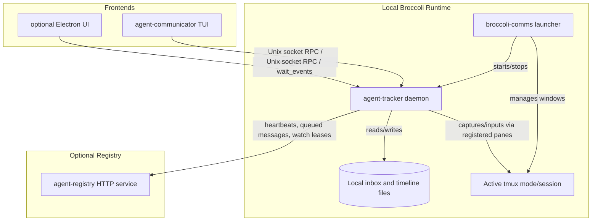

# Broccoli Comms Repository Architecture Summary

Broccoli Comms is a standalone agent workspace runtime. Its default frontend is the terminal `agent-communicator` TUI, with optional Electron/desktop code kept as a future/secondary frontend. Runtime state flows through a local tracker socket, local inbox files, tmux pane metadata, and optional HTTP registries for multi-device routing.

---

## 1. Runtime launcher: `app/broccoli-comms.py`

- Owns Broccoli runtime/cache/config paths and starts/stops the private tracker socket.
- Reconciles configured agents into the active tmux mode.
- Default tmux mode uses the user's normal tmux server and the `broccoli-comms-agents` session; `BROCCOLI_COMMS_TMUX_MODE=private` uses Broccoli's private tmux socket.
- Exposes user-facing commands such as `start`, `stop`, `ui/open`, `agent ...`, `registry ...`, `track`, and the canonical tracker wrapper `broccoli-comms agent-tracker ...`.

## 2. Backend daemon: `agent-tracker/`

- **Language**: Python, standard-library oriented.
- **Role**: Local state keeper, JSON-RPC server, inbox/timeline writer, tmux pane controller, and registry client.
- **Key modules**:
  - `rpc_handler.py`: JSON-RPC dispatcher plus shared identity helpers and thin compatibility wrappers.
  - `handlers/pane_capture.py`: pane capture request handling.
  - `handlers/inbox_handlers.py`: inbox reads, unread counts, read receipts, and related structured errors.
  - `handlers/agent_handlers.py`: registration, list, heartbeat, rename, mailbox, and unregister lifecycle logic.
  - `handlers/messaging_handlers.py`: local delivery, attachment validation, send-message routing, and direct pane input.
  - `state.py`: agent state, event buffer, group timelines, and watch leases.
  - `registry_client.py`: remote registry heartbeat, discovery, queued delivery, and remote event interactions.
  - `tmux_util.py` / `tmux_reliability.py`: tmux metadata, pane capture/input, and reliable notification helpers.

## 3. Terminal UI: `agent-communicator-tui/`

- **Language**: Go with Bubble Tea/Lip Gloss.
- **Role**: Primary interactive UI for agent conversations, inboxes, pane capture, and explicit pane-control modes.
- **Current structure**:
  - `app.go`: compact model setup and update dispatcher.
  - `update_key.go`, `update_status.go`, `update_data.go`: update handlers split by domain.
  - `view.go` plus `view_*.go`: rendering split into focused view modules.
  - `agent_list.go` and `internal/tracker/*`: tracker RPC client and list/message operations.
  - `theme.go`, `style.go`, `bubbles.go`, `markdown.go`, `pane_capture_render.go`: styling, message rendering, Markdown, and pane snapshot rendering.

## 4. Registry service: `agent-registry/`

- **Language**: Python HTTP server.
- **Role**: Optional rendezvous service for multi-device discovery, tracker heartbeats, queued messages, remote pane input, and watch/event fanout.
- Can be run through `broccoli-comms registry ...`, a NixOS/Home Manager module, or directly for development.
- Managed registry agents are supported for registry-host workflows, but local Broccoli managed agents usually live under `broccoli-comms agent ...`.

## 5. Optional Electron frontend: `agent-communicator-electron/`

- **Tech stack**: TypeScript, React, Vite, Electron.
- **Status**: Secondary/future frontend path. It talks to the same tracker socket and should preserve the runtime contracts documented in `docs/RUNTIME_API.md`.
- Keep runtime behavior in the tracker/launcher and UI-specific behavior in frontend clients.

## 6. Wrapper and skills

- `wrapper/agent-wrapper.sh` runs agent commands with the correct tracker identity/environment and registers pane metadata.
- `skills/` contains agent-facing Broccoli Comms usage guidance for messaging and CLI interactions.

## Validation entry points

- Tracker: `cd agent-tracker && env -u AGENT_TRACKER_TMUX_SOCKET -u BROCCOLI_COMMS_TMUX_SOCKET python3 -m unittest discover -q`
- TUI: `cd agent-communicator-tui && nix develop . -c go test ./...`
- Whole repo/source checks: `make check`, `nix flake check`, and smoke scripts under `scripts/`.
